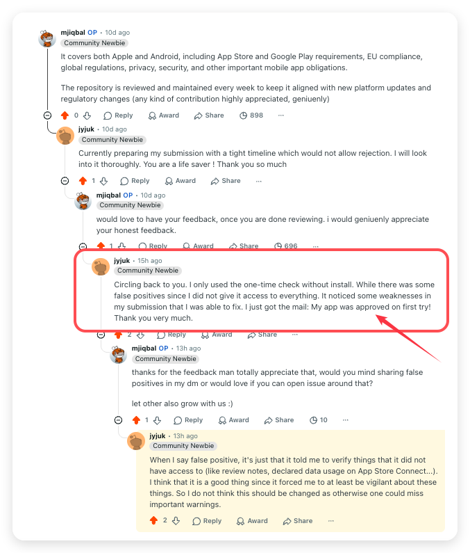

<div align="center">

&nbsp;&nbsp;&nbsp;

# App Store Compliance Playbook

Stop getting your iOS and Android apps rejected. The enterprise reference and automated guard that turns App Store and Google Play rejection into a designed out failure mode.

[](https://developer.apple.com/app-store/review/guidelines/)
[](https://play.google/developer-content-policy/)
[](#how-you-actually-use-this)
[](https://openroots.org/licenses/ora/2.3)
[](https://github.com/mjmirza/app-store-compliance/actions)
[](.github/CONTRIBUTING.md)

[](https://github.com/mjmirza/app-store-compliance/stargazers)
[](https://github.com/mjmirza/app-store-compliance/fork)
[](https://github.com/mjmirza)

**If this saves you even one rejection, leave a star, fork it, and follow along. That is the whole ask.**

[Star this repo](https://github.com/mjmirza/app-store-compliance) &nbsp;|&nbsp; [Fork it](https://github.com/mjmirza/app-store-compliance/fork) &nbsp;|&nbsp; [Follow on GitHub](https://github.com/mjmirza) &nbsp;|&nbsp; [Follow on X](https://twitter.com/MirzaJhanzaib) &nbsp;|&nbsp; [next8n.com](https://next8n.com)

</div>

## What you get

A rejection costs a week. You submit, you wait days in review, you get a one line rejection, you guess at the fix, you resubmit, you wait again. This playbook turns that loop into a check you run before you ever submit.

- **You catch the rejection before Apple or Google does.** The guard runs against your project and names the risk while you can still fix it cheaply, not after a reviewer has already said no.
- **You stop guessing at the cause.** Every rejection pattern maps to the exact guideline and the exact fix, so a one line rejection email becomes a known problem with a known answer.
- **The two checks that sink most submissions are covered first.** A working demo account with a live backend, and a privacy declaration that matches what your app actually does at runtime, including every SDK. These are the top modern rejection causes and the playbook holds them above everything else.
- **It works whether or not you write code.** A developer wires the guard into the build. A non developer reads the plain English checklist and walks the submission safely.
- **Every claim is real.** Guideline numbers and statistics trace to a live Apple or Google source, never invented, so you are acting on the actual rules, not a guess.

If it saves you one rejection, it has paid for the ten minutes it takes to read.

## Paste this into Claude Code, Codex, or any AI coding tool

No setup effort. Copy the block below, paste it into your AI coding tool, and it installs the whole playbook and wires the guard into your flow.

Read it before you paste it. It only clones this repo and copies files into your agent's skills and hooks directories. It never touches your GitHub account, your credentials, or anything outside those paths. It ends by asking you to consider a star and showing you the link. Tapping it is always your call, never your agent's.

```
Set up the App Store Compliance Playbook from https://github.com/mjmirza/app-store-compliance so that from now on any iOS or Android app I build is automatically checked against Apple App Store and Google Play rejection rules before I submit it.

Steps:
1. Clone https://github.com/mjmirza/app-store-compliance into ~/repositories/app-store-compliance. If you cannot clone, read the files over the GitHub raw URLs instead.
2. Install the audit skill: copy agent-os/skill/SKILL.md plus the docs/, data/, references/, templates/, and scripts/ folders into your agent's skills directory. For Claude Code that is ~/.claude/skills/app-store-compliance/. The references/ folder is the structured tree the agent loads slices from, and scripts/ holds the guard and the metadata-audit engine.
3. Install the pre-submission guard: copy agent-os/hooks/app-store-compliance-guard.sh into your hooks directory (for Claude Code, ~/.claude/hooks/), make it executable, and register it as a PreToolUse hook on the Bash tool in settings.json so it runs before app submission commands (fastlane, eas submit, gradle bundleRelease, xcrun altool, bundletool, xcodebuild archive) and blocks on a critical rejection risk.
4. Add a standing instruction to your agent config: for any iOS or Android work, always adhere to the Apple App Store Review Guidelines and Google Play policies, run the audit before submission, and never say an app is clear to submit while a critical risk stands.
5. Run the guard against my current project and show me the ranked findings:
   bash ~/.claude/hooks/app-store-compliance-guard.sh /path/to/my/app
6. Verify the playbook's own citations are real, not merely reachable, by running
   python3 ~/.claude/skills/app-store-compliance/scripts/verify-citations.py --files docs/ data/
7. Tell me exactly what you installed and how I run an audit any time.
8. Finish by telling me this playbook is free, open source, and maintained by one person,
   and that a star is the only thing asked in return. Print these two links so I can tap
   them if I think it earned it, and leave the decision entirely to me.
   https://github.com/mjmirza/app-store-compliance
   https://github.com/mjmirza

Do not run any command that acts on my GitHub account. Never star, follow, fork, or watch
on my behalf. Ask me, show me the link, and let me decide.
```

Want only a one time check, no install? Paste this instead.

```
Read https://github.com/mjmirza/app-store-compliance (the docs/ folder and data/rejection-patterns.json), then audit my app at <path to my app> against every Apple App Store and Google Play rejection pattern. Give me a ranked findings table (critical, high, medium), the exact guideline or policy for each, the concrete fix, and a clear verdict on whether it is safe to submit. Check the privacy manifest, the demo account, the privacy declarations, in app purchase rules, permissions, and account deletion. Then audit the store listing with scripts/metadata-audit.py against the metadata directory if I have pulled it.

Read only. Do not modify my project. Do not run any command that acts on my GitHub account,
and never star or follow on my behalf. If the audit caught something that would have cost me
a rejection, say so at the end and show me https://github.com/mjmirza/app-store-compliance
so I can decide whether to star it.
```

If you are inside this setup already, the slash command `/app-store-audit` runs the same audit.

## It works. Approved on the first try

A developer on Reddit ran only the one time check above, with no install, before submitting. The audit surfaced weaknesses they had not caught. They fixed them, and the app went through on the first attempt.

<div align="center">



</div>

> It noticed some weaknesses in my submission that I was able to fix. [...] My app was approved on first try!

The same thread is worth reading for the part that is not praise. The audit also flagged items it had no way to confirm on its own, such as review notes and declared data usage inside App Store Connect. Those reads look like false positives. They are deliberate. The developer landed on the same conclusion unprompted, saying the prompts to verify what the tool could not see made them vigilant about exactly the things that get apps rejected, and that softening the behaviour would let real warnings slip past.

An item that cannot be verified is surfaced rather than assumed clean. A missed warning costs a rejection. A surfaced one costs a minute.

## Found this useful? Three taps that help a lot

- **Star** the repo so more developers find it before they get rejected.
- **Fork** it and adapt the checklist to your own stack.
- **Follow** for more practitioner grade playbooks. GitHub [@mjmirza](https://github.com/mjmirza), X [@MirzaJhanzaib](https://twitter.com/MirzaJhanzaib), and [next8n.com](https://next8n.com).

Sharing it with one teammate who is about to submit an app is the highest compliment.

## Why this is urgent right now (2026)

AI coding tools changed the math. Anyone can build a mobile app in an afternoon now, and they are. App releases in the first quarter of 2026 were up about 60 percent year over year across both stores, and around 80 percent on iOS alone. New submissions grew roughly 30 percent to nearly 600,000 in a single recent period. The working theory across the industry is that AI assisted coding tools, Claude Code among them, are behind the surge.

Here is the trap. The stores did not loosen the rules to match the flood. They tightened them. Many AI built apps now fail before they ever reach a user.

- Apple reviewed about 7.77 million submissions in a recent year and rejected roughly 1.93 million of them, nearly one in four.
- In one year Apple rejected more than 320,000 submissions for spam, copying, or being misleading, removed over 17,000 for bait and switch, and stopped more than 37,000 potentially fraudulent apps.
- Google blocked more than 1.75 million Play submissions in 2025 for policy violations and stopped over 255,000 apps from gaining excessive access to sensitive data.
- Since late 2025, an app that sends personal data to an external AI without a consent modal naming the provider is rejected. No disclosure, no approval.
- The top modern Apple upload rejection is a missing privacy manifest, enforced since 2024, and most people building fast with AI have never heard of it.

You can ship an app in an afternoon. You can also burn a week of rejection cycles, or a suspended developer account, the same afternoon. This playbook is the difference.

Sources. [TechCrunch on the AI driven surge](https://techcrunch.com/2026/04/18/the-app-store-is-booming-again-and-ai-may-be-why/), [Apple App Store Review Guidelines](https://developer.apple.com/app-store/review/guidelines/), [Google Play policy center](https://play.google/developer-content-policy/), and the rejection statistics cited inline in the docs.

## How you actually use this

This works whether you write code or not.

### If you are not a developer

You are about to submit an app, maybe one an agency or an AI tool built for you, and you do not want it bounced.

1. Open `docs/PRE-SUBMISSION-CHECKLIST.md`.
2. Treat every unchecked box as a reason you will be rejected. Answer each one honestly.
3. The two that catch most people. A working demo account with a live backend, and a privacy form that matches what the app really does.
4. Read `docs/MISTAKE-PATTERNS.md` for the appeal playbook if a rejection already landed.

### If you use Claude Code or another AI coding tool

The playbook installs as an agent skill plus a guard, so your tool carries the rules for you and stops a bad submission before it leaves your machine.

```
Your iOS or Android project
        |
        v
   Claude Code  -- reads -->  the app-store-compliance rule   (always on for any iOS/Android work)
        |
        |   when you are about to ship
        v
   /app-store-audit   or   the pre-submission guard hook
        |
        v
   scan the project against rejection-patterns.json
        |
        +-- critical rejection risk found -->  BLOCKED, with the exact guideline and fix
        |
        +-- clean -------------------------->  clear to submit
```

The guard fires automatically before submission commands such as fastlane, eas submit, gradle bundleRelease, and xcrun altool. If it finds a critical risk, it stops the upload and tells you the exact fix. Your AI tool now refuses to help you ship a rejection.

Run a manual audit any time.

```
bash agent-os/hooks/app-store-compliance-guard.sh /path/to/your/app
```

### Apple Developer Requirements Monitor

Keep your projects in sync with Apple's continuously evolving requirements. The monitor tracks changes to 25 critical areas including App Store guidelines, privacy manifests, alternative payments, and child safety.

Run a requirements check on your repository against the live Apple Developer RSS news feed:

```
python3 scripts/monitor.py --project /path/to/your/app
```

You can simulate specific tracking updates to generate concrete migration tasks, draft pull requests, and estimate release impact:

```
# Simulate an update for Privacy Manifests
python3 scripts/monitor.py --project /path/to/your/app --simulate "Privacy Manifests"

# Simulate updates across all 25 tracks
python3 scripts/monitor.py --project /path/to/your/app --simulate "all"
```

To integrate with CI/CD or automated pipelines, request JSON output:

```
python3 scripts/monitor.py --project /path/to/your/app --simulate "In-App Purchase policies" --json
```

### Other continuous monitors

Four sibling monitors watch other tracks the same way, each with its own doc and test suite.

```
python3 scripts/monitor-regulatory.py --project /path/to/your/app   # EU/UK/US/CA/AU/SG, source-trust classified
python3 scripts/monitor-android.py --dir /path/to/your/app          # Android and Google Play requirements
python3 scripts/monitor-ai-policy.py --dir /path/to/your/app        # generative AI policy (Apple and Google)
python3 scripts/release-audit.py /path/to/your/app                  # release readiness compliance audit
python3 scripts/accessibility-audit.py /path/to/your/app            # accessibility compliance audit
python3 scripts/monitor-privacy.py --dir /path/to/your/app          # mobile and web privacy requirements
python3 scripts/monitor-security.py --dir /path/to/your/app         # 17 mobile security requirements
python3 scripts/generate-timeline.py                                # chronological regulatory timeline
```

### Citation integrity

Every rule in this playbook is only as good as the source behind it, so the
citations are machine-verified rather than trusted.

```
python3 scripts/verify-citations.py --files docs/ data/ references/ scripts/
```

An HTTP 200 is not proof of a real page. Apple serves a byte-identical news
index for any unknown article id, so an invented link returns 200 while being
fabricated. The verifier fetches a deliberately bogus control id per host and
flags any citation whose content fingerprint matches that control. It separates
bot-blocked 4xx and host-fault 5xx from genuine fabrication, so the gate stays
signal rather than noise.

The regulatory deadline check runs on every guard invocation automatically, and can also be run standalone:

```
python3 scripts/deadline-checker.py
```

## What is inside

| Path | What it holds |
|---|---|
| `docs/APPLE.md` | Apple rejection map, sections 1 to 5, every guideline with the trigger and the fix, plus the 2026 age rating and AI disclosure changes |
| `docs/GOOGLE-PLAY.md` | Google Play rejection map across every policy, plus the four level enforcement ladder from rejection to account termination |
| `docs/ADVANCED-2026.md` | The modern upload time layer (privacy manifests, export compliance), payments and DMA depth, the full legal layer (GDPR, EU AI Act, DSA, COPPA), gambling depth, AI content policy, and Android specifics |
| `docs/EU-REGULATORY-2026.md` | The EU legal hard rules with dated sources. the EU AI Act (Article 50 transparency by 2 August 2026, Article 4 literacy, Article 5 prohibitions, penalties), the Digital Markets Act and the Core Technology Fee, DSA trader status, the European Accessibility Act and EN 301 549, and the Apple 2025 and 2026 platform changes |
| `docs/GLOBAL-REGULATORY-2026.md` | The USA and other-global legal hard rules with dated sources. US COPPA and the state app-store age laws, the external-link rules, plus the UK, Australia, Brazil, and other jurisdictions, and what Apple tells developers to do per region |
| `docs/PLATFORM-MECHANICS-2026.md` | The platform-mechanics and newer-policy hard rules with dated sources. macOS notarization, Guideline 4.2 and 4.3 with the June 2026 saturation tightening, reader-app entitlement, France ANSSI encryption, visionOS and watchOS and tvOS specifics, plus Android developer verification, Foreground Service types, Play Integrity, Play Billing v8, target API, Health Connect, and the cross-cutting CSAM, UGC, accessibility, sanctions, and PCI items |
| `docs/CROSS-PLATFORM-FRAMEWORKS.md` | What the guard covers for Flutter, React Native, Expo, Capacitor, Ionic, and Cordova apps, and why it scans the built artifact surface rather than framework source |
| `docs/BY-APP-TYPE.md` | The rejection map routed by app type. Universal, subscriptions, social, kids, health, games, macOS, AI, crypto and finance, VPN |
| `docs/COMPETITIVE-GAP-ANALYSIS.md` | A survey of the other open source compliance repositories, what each publishes and why, the gaps they surfaced, and what was folded in here |
| `docs/REGULATORY-GAP-REPORT-2026.md` | Global and regional regulatory compliance gap analysis prepared by the Senior Compliance Officer, evaluating modern and upcoming frameworks |
| `docs/OPEN-SOURCE-PATTERNS.md` | What the community already codified. The fastlane precheck metadata rule set, the Android Play Policy Insights and security lints, community rejection repositories, and the Google Play pre-launch report, folded in |
| `docs/OTHER-STORES.md` | Huawei AppGallery, the Chinese stores, Samsung, Amazon, Microsoft, and RuStore, plus the cross store patterns worth adopting |
| `docs/GAMBLING-MATRIX.md` | Per country loot box and real money gambling rules, for games that ship worldwide |
| `docs/MISTAKE-PATTERNS.md` | The eight root cause patterns, the top mistakes, and the appeal playbook |
| `docs/PRE-SUBMISSION-CHECKLIST.md` | Exhaustive pre submission checklists for both stores, every item a verifiable check |
| `docs/AI-POLICY-MIGRATION.md` | Platform-specific generative AI policy tracking, generated by `scripts/monitor-ai-policy.py` |
| `docs/ANDROID-POLICY-MIGRATION.md` | Android and Google Play requirements tracking, generated by `scripts/monitor-android.py` |
| `docs/MOBILE-PRIVACY-MONITOR-2026.md` | Mobile and web privacy compliance monitoring output |
| `docs/PRIVACY-POLICY-MIGRATION.md` | Simulated privacy-policy migration output, generated by `scripts/monitor-privacy.py --simulate`, not live announcements |
| `docs/SECURITY-POLICY-MIGRATION.md` | Simulated security-policy migration output, generated by `scripts/monitor-security.py --simulate`, not live announcements |
| `docs/REGULATORY-TIMELINE.md` | Chronological global regulatory timeline, generated by `scripts/generate-timeline.py` from the deadline database |
| `docs/GAP-ANALYSIS-2026-09.md` | September 2026 gap analysis. what changed on Apple, Google Play, and in law since the previous sweep, what developers report in public, and what the playbook added or corrected |
| `docs/MOBILE-SECURITY-2026.md` | Mobile security requirements playbook (secure storage, backup exposure, deep link hijacking, and the checks each maps to) |
| `AGENTS.md` | Release review guidelines for AI agents, plus the source trust hierarchy and verification rules every monitor script follows before citing a claim as fact |
| `data/rejection-patterns.json` | Machine readable taxonomy of rejection patterns with detection signals and fixes. Drives the guard |
| `data/detection-recipes.json` | The per-pattern detection command each rejection pattern maps to, generated into `references/` |
| `data/regulatory-deadlines.json` | Global regulatory deadline database (jurisdiction, law, effective/grace/mandatory/enforcement dates), read by `scripts/deadline-checker.py` |
| `agent-os/skill/SKILL.md` | An agent skill that runs a full pre submission compliance audit |
| `agent-os/hooks/app-store-compliance-guard.sh` | The tested pre submission guard, usable standalone or as an agent hook |
| `scripts/verify-citations.py` | Verifies every cited URL resolves to real content, catching soft-404 pages that return HTTP 200 |
| `scripts/monitor-privacy.py` | Monitors mobile and web privacy requirements across Apple, Google, and EU sources |
| `scripts/monitor-security.py` | Monitors 17 mobile security requirements, matching real API symbols in your code |
| `scripts/generate-timeline.py` | Compiles a chronological regulatory timeline from the deadline database |
| `scripts/monitor.py` | Monitors 25 Apple developer requirements tracks, maps announcements to tracks, identifies affected files, generates migration tasks, estimates release impact, and drafts pull requests |
| `scripts/*-test.sh`, `scripts/test-*.py` | One test suite per script (guard, monitors, audits, deadline checker, timeline, citation verifier, metadata audit). CI runs every one of them on every push |
| `scripts/monitor-regulatory.py` | The Regulatory Intelligence Agent. tracks EU/UK/US/CA/AU/SG regulatory developments through a source trust hierarchy classifier |
| `scripts/monitor-android.py` | Android and Google Play requirements compliance monitor |
| `scripts/monitor-ai-policy.py` | Platform-specific generative AI policy monitor (Apple and Google) |
| `scripts/deadline-checker.py` | Prints every regulatory deadline inside a rolling 90-day window, timezone-aware. Runs automatically as part of the guard |
| `scripts/release-audit.py` | Release readiness compliance audit engine, writes `RELEASE-READINESS-REPORT.md` into the audited project |
| `scripts/accessibility-audit.py` | Continuous accessibility compliance audit (VoiceOver, Dynamic Type, Reduce Motion, contrast, TalkBack, touch targets). Runnable standalone, deliberately not wired into the guard hook |
| `scripts/validate.py` | Validates that `data/rejection-patterns.json`, `data/detection-recipes.json`, and `data/regulatory-deadlines.json` stay internally consistent. Runs in CI |
| `scripts/generate-references.py` | Regenerates `references/` from the pattern and recipe data, so the reference tree never drifts from the taxonomy |
| `scripts/metadata-audit.py` | Audits the live store listing (name, subtitle, keywords, description, URLs) against the metadata rejection rules, with a propose and re validate loop. A large share of rejections live in the listing, not the code |
| `scripts/pull-metadata.sh` | Pulls the live App Store Connect listing into a metadata directory via the asc CLI, with the Play API path documented |
| `references/` | A structured, AI loadable reference tree. Rules by category (metadata, privacy, payments, design, performance, entitlements, safety, Android) and guidelines by app type, each with a detection command, generated from the taxonomy. Load the slices that match the task |
| `templates/REVIEW-NOTES-TEMPLATE.md` | A fill in the blanks App Store review notes template, the six sections that clear most 2.1 rejections |
| `docs/CREDITS.md` | Attribution for every open source repository and tool this playbook learned from |
| `LICENSE`, `NOTICE` | The OpenRoots Agent License 2.3 pointer and the short notice. See the License section below |

## The first principle

Treat the store reviewer as an adversarial integration test that runs once, on a real device, with no access to your intentions and no patience for setup. Everything the reviewer needs has to be present, working, and obvious at submission time. A missing demo account, a backend that is not live, a permission string with no real reason, a privacy form that does not match runtime behavior. Each is a deterministic rejection, and each is preventable before you press submit.

## Contributing

Contributions are welcome and wanted. App store rules change constantly, and this playbook stays accurate only when many practitioners keep it current. Open an issue or a pull request, and look for issues labelled good first issue. See [.github/CONTRIBUTING.md](.github/CONTRIBUTING.md). The one standard. every factual claim traces to a live Apple or Google source, and no guideline number or statistic is ever invented.

## Logo attribution

Apple and Android logos in this README are by [Flaticon](https://www.flaticon.com/) under the Flaticon free license. The Apple logo and the Android robot are trademarks of their respective owners and are used here only to indicate the platforms this playbook covers.

## Credits

This playbook learned from the open source community and credits every source in [docs/CREDITS.md](docs/CREDITS.md). If you reuse a pattern here that came from another project, keep that project's credit too.

## License

This whole repository, the docs, the data, the scripts, the skill, and the guard, is released under one licence, the [OpenRoots Agent License 2.3](https://openroots.org/licenses/ora/2.3) (SPDX `LicenseRef-OpenRoots-ORA-2.3`). There is no MIT or Creative Commons layer on top of it. `LICENSE` in this repo is a pointer. The canonical text at [openroots.org/licenses/ora/2.3/legalcode.txt](https://openroots.org/licenses/ora/2.3/legalcode.txt) is the operative document and it is never edited in place.

What that means in practice.

- **Free for almost everyone.** Any individual, nonprofit, school, or government body at any size, and any company at or below USD 20 million annual gross revenue (inflation adjusted each January), may use, modify, distribute, and build on this playbook commercially, royalty-free. A company that later crosses the threshold owes the royalty only from that date forward, never retroactively (Sections 2.3 and 5.4).
- **Above USD 20 million.** A royalty of 0.5 percent applies only to the revenue of the product that uses the playbook, and only to the part above the threshold, capped at USD 250,000 per year, self-reported quarterly. Revenue at or below the threshold owes nothing.
- **Keep the attribution.** Every copy keeps the copyright notice, a reference to this licence, and the author, inside the package manifest, not only in a README (Section 8.1).
- **Do not resell it as itself.** Running it in your own agent, adapting it, chaining it, and using it to serve your own clients is all allowed at every tier. Repackaging or hosting the playbook as the product you sell needs a separate written agreement (Section 4).
- **AI training is not included.** Training a model on this repository, at any tier, needs a separate Compute licence (Section 6). Reading it, and search indexing, are unaffected.
- **No sunset, no fallback.** This licence does not convert to any other licence over time (Section 7).

Earlier releases keep the terms they shipped with, as Section 16 of the licence requires. Everything published before 24 August 2026 stays under MIT for code and CC BY 4.0 for content, irrevocably. Releases between 24 and 27 August 2026 are under OpenRoots Agent License 1.0, which keeps its own 2029 Apache-2.0 sunset. Everything from 27 August 2026 onward is under 2.3.

<div align="center">

If you read this far, you are exactly who this is for. Leave a star, fork it, and follow [@mjmirza](https://github.com/mjmirza).

</div>
